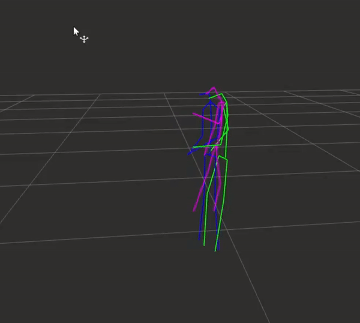
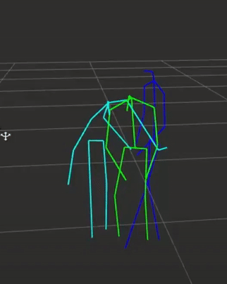
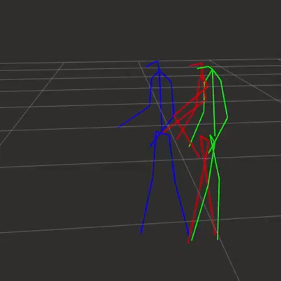

# Human Motion Forecasting for Dynamic Human Robot Collaboration

This repository contains a Neural Network model for Human Motion Forecasting in the context of Dynamic Human-Robot Collaboration as well as visualisation tools to compare state of the art models on real-time skeleton data captured with an Azure Kinect leveraging ROS 3D visualizer software RViz. The network architecture relies on Graph Convolutional Network, Self-Attention Layers and LSTMs. This code is the implementation of a research project conducted at the [Barton Research Group](https://brg.engin.umich.edu/research/human-digital-twins/).

&nbsp;

  

# Content

[***Objective***](https://github.com/leob03/human_motion_forecasting#objective)

[***Comparisons***](https://github.com/leob03/human_motion_forecasting#comparisons)

[***Concepts***](https://github.com/leob03/human_motion_forecasting#concepts)

[***Architecture***](https://github.com/leob03/human_motion_forecasting#architecture)

[***Dependencies***](https://github.com/leob03/human_motion_forecasting#dependencies)

[***Getting started***](https://github.com/leob03/human_motion_forecasting#getting-started)

[***References***](https://github.com/leob03/human_motion_forecasting#references)

[***Acknowledgments***](https://github.com/leob03/human_motion_forecasting#acknowledgments)

# Objective

**With a simple RGB-D Camera predict the future motion of a human in a Smart Manufacturing workspace of to ensure safety in human-robot interactions.**

# Comparisons

During this project we studied and implemented multiple methods for Human Motion Forecasting, compared their performance (accuracy, speed and memory consumption) on Human 3.6M but most of all on our own Human-Robot Collaboration workspace set up. Indeed, we wanted to have an idea of how these models performed on real-time data. We compared the results of these implenetations on real-time skeleton data captured with the Azure Kinect SDK and worked on a visualization tool to compare those results. Finally, based on this previous study chose one method as a benchmark ("History Repeats Itself" by Wei Mao) and tried multiple different types of architecture improvements to obtain even better results.

These are some visuals of the results obtained:

&nbsp;

<!--   Some visual results of : -->
   
  

&nbsp;

<!--   Some visual results of : -->
   
  

&nbsp;

<!--   Some visual results of : -->
   
  

&nbsp;

# Concepts

Most of the concepts are described quite in depth in the paper but here is a quick summary of the main concepts exploited in this project:

* **Point-Cloud processing**. Point cloud processing involves handling and analyzing data that represents a set of points in three-dimensional space. Each point in the cloud typically contains information about its spatial coordinates and may include additional attributes like color or intensity. Point cloud processing techniques are used in various applications such as 3D reconstruction, object recognition, autonomous driving, and environmental modeling. The goal is to extract meaningful information, perform geometric analysis, and apply machine learning algorithms to understand and interact with the 3D world captured by the point cloud data.

* **Encoder-Decoder architecture**. Auto-encoders or Encoder-Decoders are artificial neural networks that learn how to efficiently compress and encode data into a smaller but meaningful latent-space and then learns how to decode it back such that the reconstructed input is as similar as possible to the original one.

* **Attention**. Originally attention functions have been introduced as an improvement from Residual Neural Networks (RNN) that struggle to deal with long-range dependencies in sequence to sequence transduction tasks. Indeed, in RNNs, the input sequence is bottlenecked through a fixed-size vector called the context vector which results in a significant loss of information for long-range input sequences and a lack of consideration to local features. So this new idea of attention function introduced in the famous paper ”Attention is all you need”[4], uses a new context vector at each step of the output sequence to ”look at” different parts of the input sequence and consider local features.

* **Shape Classification**. Shape classification involves categorizing or classifying 3D shapes into predefined categories or classes based on their geometric properties and features. The goal is to assign each shape to the most appropriate category, enabling shape recognition and organization in various applications, such as computer-aided design, object recognition, and medical imaging.

* **Part Segmentation**. Part segmentation, on the other hand, focuses on dividing a 3D shape into its constituent parts or components. The objective is to segment the shape into meaningful subregions or parts, each corresponding to a specific component or structure. Part segmentation is valuable in tasks like object analysis, shape reconstruction, and understanding the functional components of complex shapes, such as objects or human anatomy.

# Architecture

  
   
  The Neural Network architecture of our Method

# Dependencies
**Python 3.10**, modern version of **PyTorch**, **numpy** and **scipy** module. Most of these are okay to install with **pip**. To install the rest of the dependencies all at once, run the command `./install.sh`

I only tested this code with Ubuntu 20.04, but I tried to make it as generic as possible (e.g. use of **os** module for file system interactions etc. So it might work on Windows and Mac relatively easily.)

# Getting started

1. **Get the code.** `$ git clone` the repo and install the Python dependencies.
2. To run a predefined simple demo of the code and test the main results run the command `python demo.py`

## Testing the Encoder on 3D Shape Classification task:

To train our encoder on 3D Shape Classification task we had to make some small modifications on the network architecture in order to interpret and reduce the latent space into a set of vectors representing the object category labels. To this extent we added a Global Average Pooling Layer before the final projection layer to which we also adapted the dimensions in order to get a vector of the size of the number of categories. Fig 6 represents the structure used for 3D Shape Classification.

Then, we evaluated it on ModelNet40, a dataset containing 12,311 CAD models with 40 object categories. They are split into 9,843 models for training and 2,468 for testing. As in PointNet++ [3] we preprocessed the data through uniform sampling of each CAD model together with the normal vectors from the object meshes. For evaluation metrics, we use the mean accuracy within each category and the overall accuracy over all classes. (The results are in the paper)

  
   
  The modified architecture of our encoder to test it on 3D Shape Classification

1. **Get the data.** Download alignment **ModelNet** [here](https://shapenet.cs.stanford.edu/media/modelnet40_normal_resampled.zip) and save in `modelnet40_normal_resampled`.
2. **To train the model for Classification:** Run the training `$ python train/train_classification.py`. You'll see that the learning code writes checkpoints into `log/cls/Leo/train_classification.log` and periodically print its status. 
3. **Evaluate the models checkpoints.** To evaluate a checkpoint from `models/`, run the scripts `$ python eval_classification.py`. You'll see that the learning code writes checkpoints into `log/cls/Leo/eval_classification.log` and periodically print its status. 

## Testing the Auto-Encoder on 3D Part-Segmentation task:

To train our whole network on 3D Shape Classification task we also had to make some small modifications on the architecture. Indeed, an auto-encoder is only expected to output a reconstruction of the input in its initial structure with a little degradation due to the loss of information in the data compression for the latent space. However, to perform part- segmentation we had to assign each point to a part label.

Then, we evaluated it on the ShapeNetPart dataset which is annotated for 3D object part segmentation. It consists of 16,880 models from 16 shape categories, with 14,006 3D models for training and 2,874 for testing. The number of parts for each category is between 2 and 6, with 50 different parts in total. In our case we only kept 4 parts: the airplane which as 4 parts, the bag which as 2 parts, the cap which as 2 parts and the car which as 4 parts. Again we preprocessed the data using PointNet++[3] sampling technique. For evaluation metrics, we report category mIoU and instance mIoU. (The results are in the paper)

  
   
  The architecture of our auto-encoder to test it on 3D Part Segmentation

1. **Get the data.** Download alignment **ShapeNet** [here](https://shapenet.cs.stanford.edu/media/shapenetcore_partanno_segmentation_benchmark_v0_normal.zip) and save in `data/shapenetcore_partanno_segmentation_benchmark_v0_normal`.
2. **To train the model for Part Segmentation:** Run the training `$ python train/train_partsegmentation.py`. You'll see that the learning code writes checkpoints into `log/partseg/Leo/train_classification.log` and periodically print its status. 
3. **Evaluate the models checkpoints.** To evaluate a checkpoint from `models/`, run the scripts `$ python eval_partsegmentation.py`. You'll see that the learning code writes checkpoints into `log/partseg/Leo/eval_partsegmentation.log` and periodically print its status. 

# References

# Acknowledgments
Some code and training settings are borrowed from both https://github.com/yanx27/Pointnet_Pointnet2_pytorch and from the paper [PCT: Point Cloud Transformer (Meng-Hao Guo et al.)](https://arxiv.org/abs/2012.09688) which original implementation is accessible here: https://github.com/MenghaoGuo/PCT.

